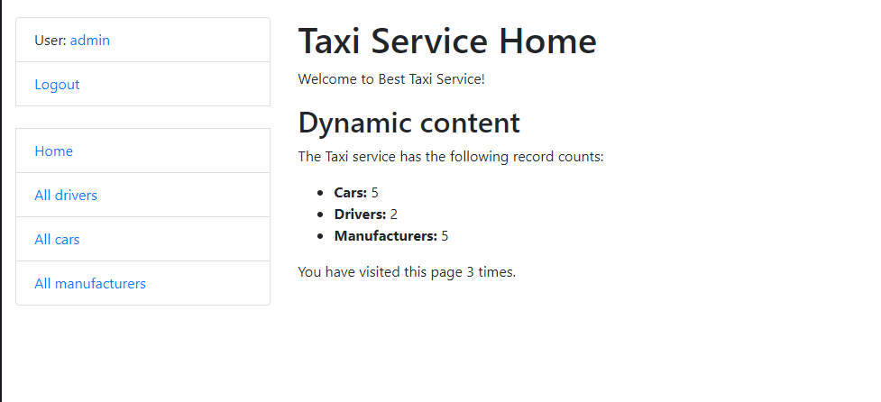

# Taxi Service Project

Django project for managing drivers, cars and manufacturers for Taxi Service, with support of authentication.

## Check it out!

[Taxi Service project deployed to Heroku](https://taxi-service-py.herokuapp.com/)

## Installation

[Python 3](https://www.python.org/downloads/) and [git](https://git-scm.com/book/en/v2/Getting-Started-Installing-Git) must be already installed

### With pip

```bash
git clone https://github.com/roland813/taxi_service.git
cd taxi_service
python3 -m venv venv
source venv/bin/activate (on Linux and macOS) or venv\Scripts\activate (on Windows)
pip install -r requirements.txt
python manage.py migrate
python manage.py createsuperuser
python manage.py runserver
```

### With poetry

[Poetry](https://python-poetry.org/docs/#installation) must be already installed

```bash
git clone https://github.com/roland813/taxi_service.git
cd taxi_service
poetry install
poetry shell
python manage.py migrate
python manage.py createsuperuser
python manage.py runserver
```

## Features

* Authentication functionality for Driver/User
* Managing cars, drivers and manufacturers directly from website interface
* Powerful admin panel for advanced managing

## Access

Demo full accesses for guests: 
* Username - guest
* Password - Qwerty@9

## Demo

